<div align="center">

# 💰 SpendWise

**Smart expense tracking powered by NLP, SMS automation, and real-time financial insights.**


> Track expenses automatically. Understand spending instantly. Manage finances smarter.

</div>

---

## Why SpendWise?

In today's digital world, people make payments through multiple platforms such as Paytm, PhonePe, Google Pay, banking applications, credit cards, and other UPI services. As transactions are spread across different apps and accounts, it becomes difficult to track expenses and gain a complete understanding of personal spending habits.

SpendWise addresses this challenge by automatically extracting transaction details from SMS messages and consolidating them into a single, unified dashboard. Users no longer need to switch between multiple applications or manually record expenses. By bringing all transactions together in one place, SpendWise provides a clear overview of spending patterns, helps identify unnecessary expenses, and enables smarter financial decisions.

---

## 📖 What is SpendWise?

SpendWise is an AI-powered personal finance management application that automatically tracks expenses from transaction SMS messages and transforms them into meaningful financial insights.

Unlike traditional expense trackers that rely on manual data entry or rule-based SMS parsing, SpendWise leverages a **TinyBERT-based Named Entity Recognition (NER) model** to intelligently understand transaction messages and convert them into structured financial records.

The application automatically extracts key information such as transaction amount, merchant name, payment method, and account details from bank and UPI messages. These transactions are then categorized and visualized through interactive analytics, allowing users to better understand their financial behavior.

Whether you're monitoring daily expenses, managing budgets, identifying spending trends, or reviewing monthly financial activity, SpendWise simplifies personal finance management by bringing all your transactions into a single platform.


---

## 📸 Screenshots

### 🔐 Authentication

<p align="center">
  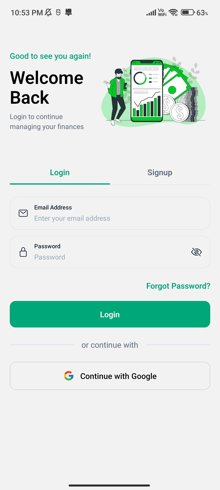
  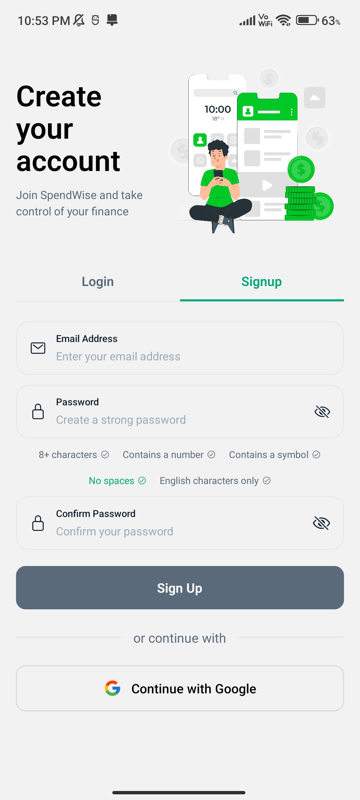
  
</p>

### 👋 Welcome & Onboarding

<p align="center">
  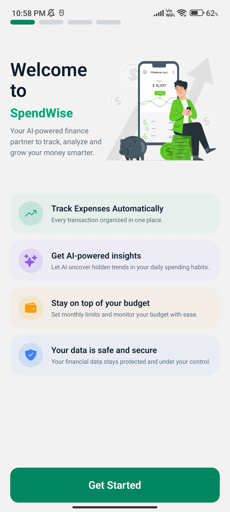
  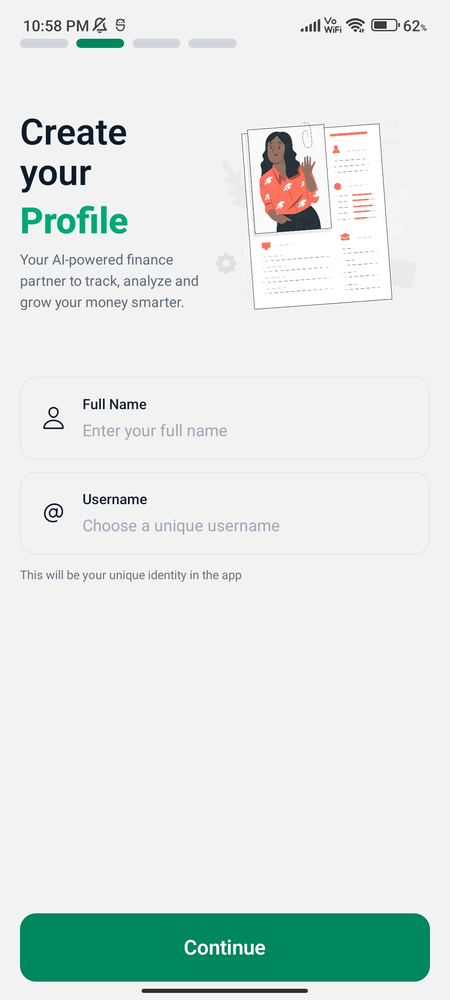
  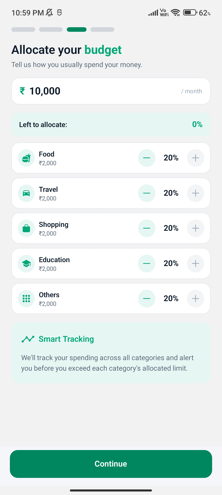
  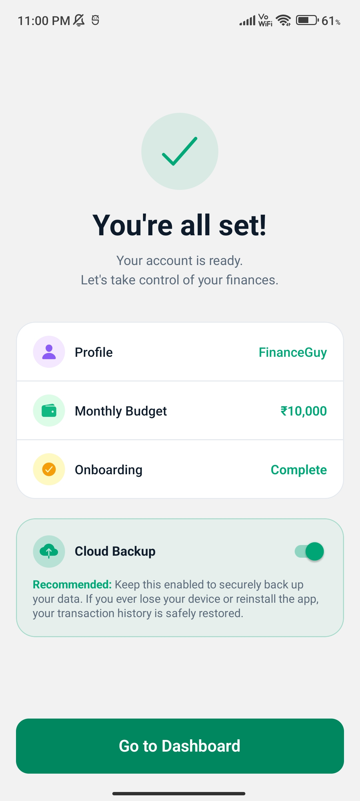
</p>

### 🏠App
#### Home, Transaction and Profile Page
<p align="center">
  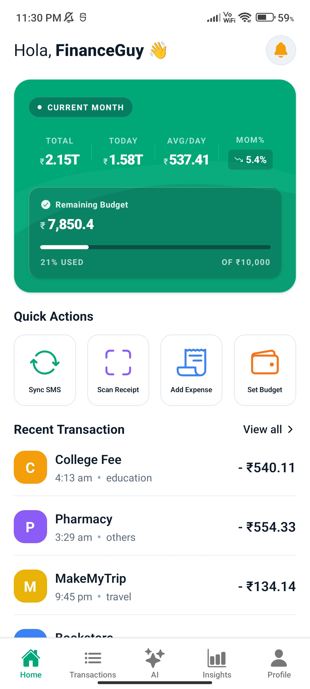
  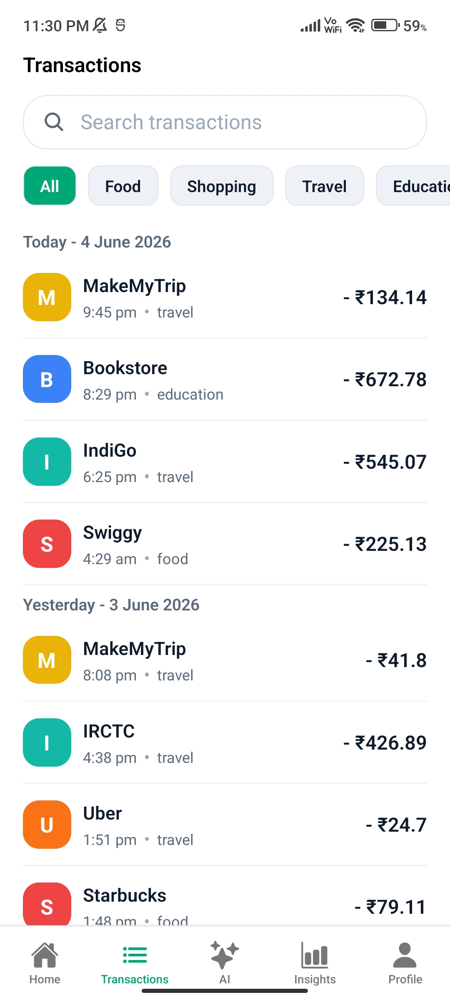
  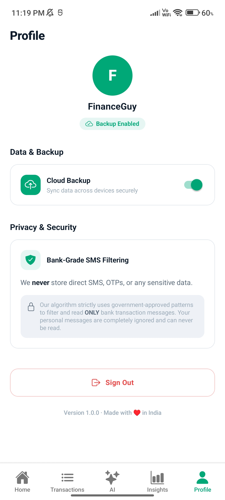
</p>

#### AI Assitant
<p align="center">
  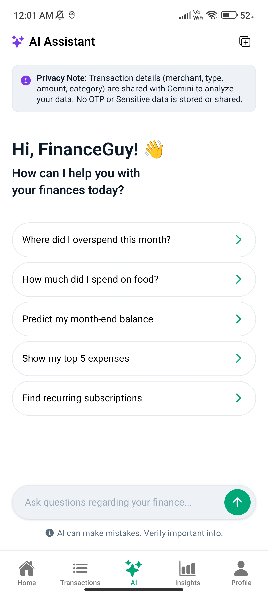
  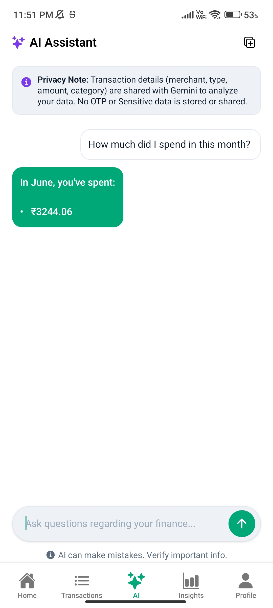
</p>

#### Insights Page
<p align="center">
  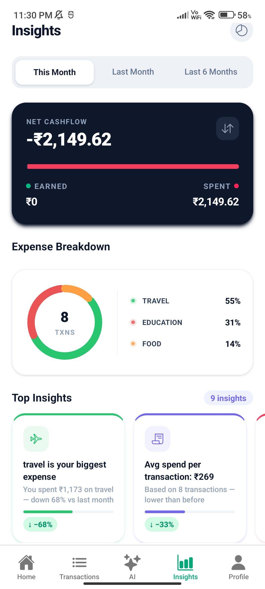
  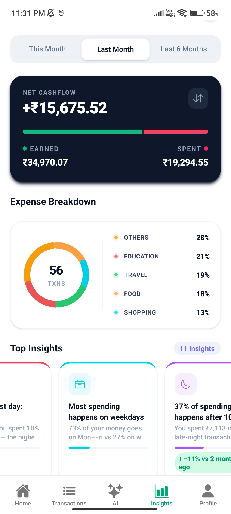
  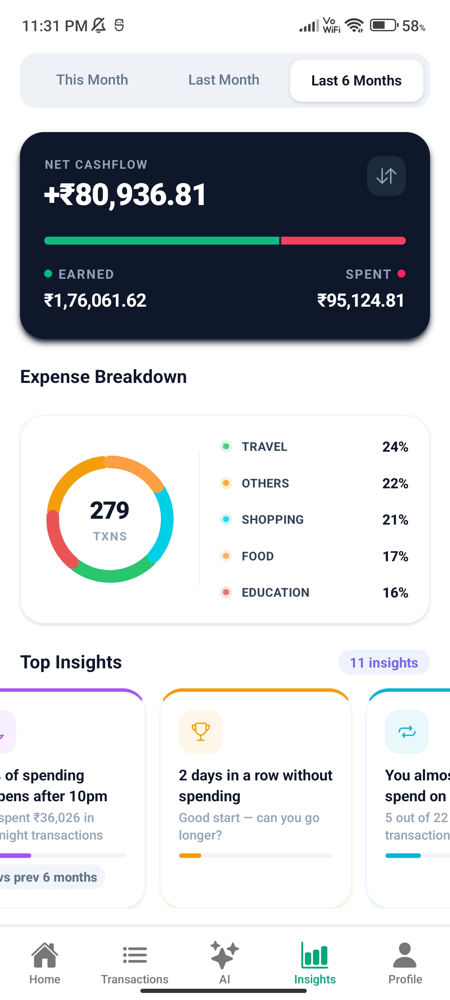
</p>

---

## ✨ Features

### 📩 Smart SMS Expense Detection

SpendWise automatically detects and processes transaction SMS messages from banks, credit cards, and UPI services. As soon as a transaction occurs, the app extracts relevant details and records the expense without requiring any manual input.

* Automatic transaction detection
* Real-time expense recording
* Support for multiple SMS formats
* No manual expense entry

---

### 🤖 NLP-Powered SMS Understanding

Traditional rule-based SMS parsers break whenever banks change message formats. SpendWise solves this problem using a Natural Language Processing (NLP) pipeline powered by a quantized TinyBERT model running entirely on-device.

The model performs **Named Entity Recognition (NER)** on transaction SMS messages to identify and extract key financial entities such as:

* Transaction Amount
* Merchant Name
* Transaction Type
* Account Number
* UPI IDs
* Date & Time Information

Example SMS:

```text
Rs.450 debited from A/C XXXX1234 at Amazon

INR 1299 spent using SBI Card at Swiggy

Transaction of Rs.2500 completed via UPI to Rahul
```

The NER model converts these unstructured messages into standardized transaction records that can be analyzed and categorized automatically.

#### Why TinyBERT?

* Lightweight and optimized for mobile devices
* Fast on-device inference
* No internet connection required
* Better adaptability across different bank SMS formats
* Enhanced privacy since SMS data never leaves the device

This NLP-based approach significantly improves extraction accuracy compared to traditional regex-only parsers while maintaining complete user privacy.

---

### 🏷 Automatic Expense Categorization

Every transaction is automatically assigned to an appropriate category, helping users understand spending patterns without manually organizing expenses.

Supported categories include:

* Food
* Shopping
* Travel
* Education
* Others

---

### 📊 Spending Analytics & Insights

Visual dashboards provide a clear overview of spending behavior through interactive charts and category-wise breakdowns.

Track:

* Monthly Expense Trends
* Category Distribution
* Spending Patterns
* Income vs Expense Analysis
* Top Spending Categories

---

### 🎯 Budget Tracking

Set spending limits and monitor progress throughout the month.

Features include:

* Monthly Budget Goals
* Category-wise Budget Tracking
* Spending Progress Indicators
* Overspending Alerts

---

### 💬 AI Financial Assistant

Interact with your financial data using natural language. Ask questions about your spending habits and receive instant insights powered by AI.

Examples:

* "How much did I spend on food this month?"
* "Which category had the highest expenses?"
* "What was my biggest transaction last week?"
* "Show my spending trends for the past 3 months."

---

### ☁️ Optional Cloud Synchronization

Users can securely back up and synchronize financial data across devices using Supabase.

Benefits:

* Multi-device Access
* Secure Cloud Backup
* Real-time Synchronization
* Data Recovery Support

---

### 📱 Offline-First Local Storage

SpendWise works completely offline using local device storage.

Benefits:

* Fast Performance
* Enhanced Privacy
* No Internet Dependency
* Full Access to Transaction History

---

### 🔐 Secure Authentication

User accounts are protected through modern authentication mechanisms.

Supported methods:

* Email & Password Login
* Google Sign-In
* Email Verification
* Password Reset
* Secure Session Management

---

## 🛠 Tech Stack

| Layer          | Technology                                    |
| -------------- | --------------------------------------------- |
| Framework      | React Native + Expo                           |
| Language       | TypeScript                                    |
| Navigation     | Expo Router                                   |
| Backend        | Supabase                                      |
| Authentication | Supabase Auth, Google OAuth                   |
| Database       | Supabase PostgreSQL                           |
| Local Storage  | SQLite / AsyncStorage                         |
| SMS Processing | Android SMS APIs                              |
| NLP Engine     | TinyBERT-based Named Entity Recognition (NER) |

---

## 👨‍💻 Author

**Jaitej C**

Built with ❤️
